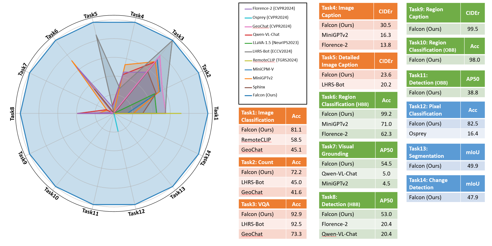
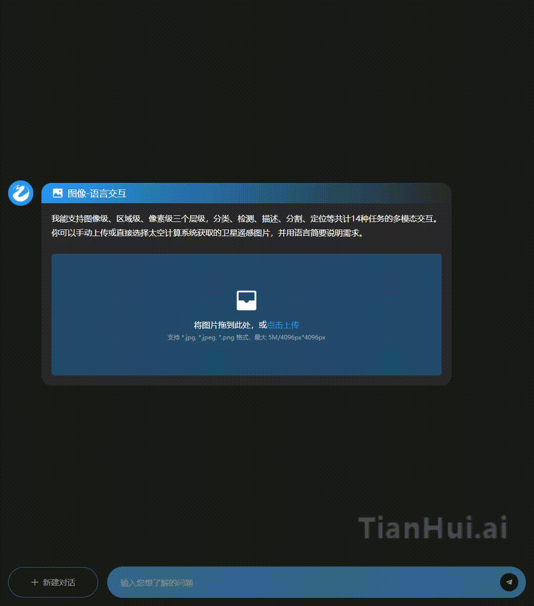
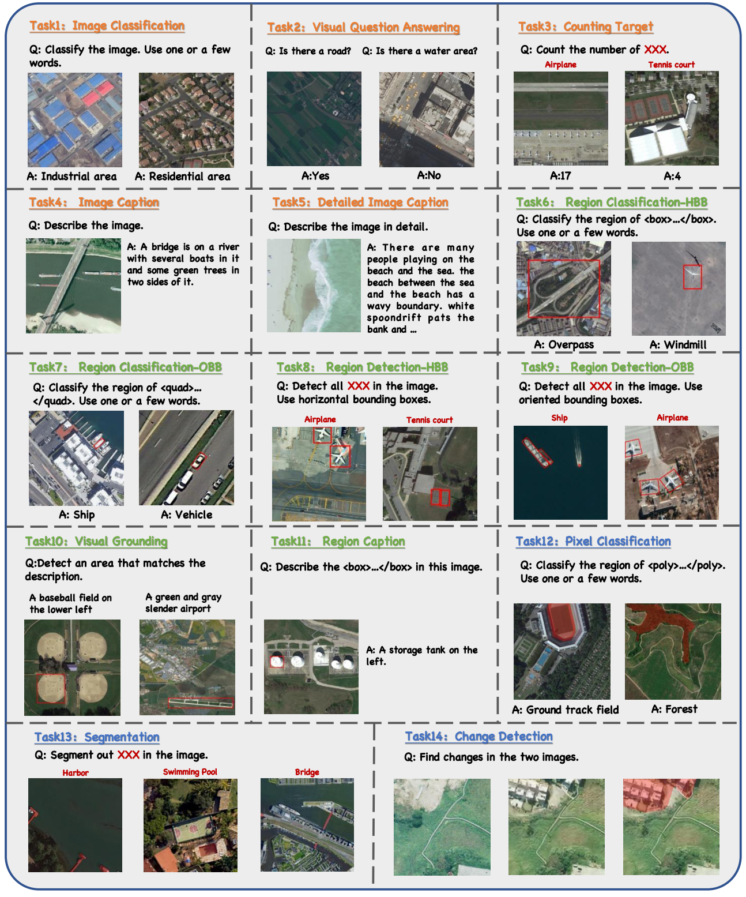

<div align="center">

#  Falcon: A Remote Sensing Vision-Language Foundation Model

<div align="center">
  
  <br>
</div>

[\[🚀 Quick Start\]](#quick-start-with-Falcon)




</div>

## Introduction
We are excited to introduce Falcon, which offers a unified, prompt-based paradigm that effectively executes comprehensive and complex remote sensing vision tasks. Falcon demonstrates powerful understanding and reasoning abilities at the image, region, and pixel levels. Specifically, given simple natural language instructions and remote sensing images, Falcon can produce impressive results in text form across 14 distinct tasks, i.e., image classification, object detection, segmentation, image captioning, and etc.

## Demonstration
Here we provide some demonstrations of Falcon on several remote sensing image interpretation tasks:

<details>
  <summary>Demo for image-level tasks: (click to expand)</summary>
<div align="center">
  
  <br>
</div>
</details>

<details>
  <summary>Demo for region-level tasks: (click to expand)</summary>
<div align="center">
  
  <br>
</div>
</details>


## News 🚀🚀🚀

- `2024/11/27`: Falcon has been released. The model checkpoints is now available on HuggingFace & modelscope, and both training / evaluation scripts are open-sourced. The Falcon_SFT dataset is coming soon!


## Model Zoo

<table>
  <tr>
    <th>Model Name</th>
    <th>Model Size</th>
    <th>HF&nbsp;Link</th>
    <th>MS&nbsp;Link</th>
  </tr>
  <tr>
    <td>Falcon-Single-Instruction-Base</td>
    <td>0.3B</td>
    <td><a href="https://huggingface.co/TianHuiLab/Falcon-Single-Instruction-Base">🤗 link</a></td>
    <td><a href="https://www.modelscope.cn/models/TianHuiLab/Falcon-Single-Instruction-Base">🤖 link</a></td>
  </tr>
  <tr>
    <td>Falcon-Single-Instruction-Large</td>
    <td>0.7B</td>
    <td><a href="https://huggingface.co/TianHuiLab/Falcon-Single-Instruction-Large">🤗 link</a></td>
    <td><a href="https://www.modelscope.cn/models/TianHuiLab/Falcon-Single-Instruction-Large">🤖 link</a></td>
  </tr>
  <tr>
    <td>Falcon-Multi-Instruction-Large</td>
    <td>0.7B</td>
    <td><a href="https://huggingface.co/TianHuiLab/Falcon-Multi-Instruction-Large">🤗 link</a></td>
    <td><a href="https://www.modelscope.cn/models/TianHuiLab/Falcon-Multi-Instruction-Large">🤖 link</a></td>
  </tr>
</table>

## Falcon_SFT
Falcon_SFT dataset can be found in [here](https://www.modelscope.cn/datasets/TianHuiLab/FCD-78M).

## What can Falcon do?


## Quick Start with Falcon

<details>
  <summary>Installation (click to expand)</summary>
You can use the following script to install the environment：

```bash
conda create -n falon python=3.10
conda activate falcon
pip install -r requirements.txt
```
Optionally, we also provide a Docker image in [here](https://hub.docker.com/r/tianhuilab/falcon/tags) for fast deployment of the environment. You can use the following script to pull this Docker image：
```bash
docker pull tianhuilab/falcon:1209
```
</details>

<details>
  <summary>Inference on 14 tasks (click to expand)</summary>

Here we provide 14 example scripts to demonstrate how to use Falcon to perform inference on 14 tasks. We provide many image samples in [here](https://github.com/TianHuiLab/Falcon/tree/main/image_samples) for you to try with.

```bash
# Inference for Image Classification task
python inference.py \
    --checkpoint_path <path_to_the_checkpoint_you_want> \
    --image_path image_samples/IMG_CLS/[IMG_CLS]_003_AID_3525_river_192_ori.png \
    --post_process_type IMG_CLS \
    --prompt "Classify the image."
```
```bash
# Inference for Visual Question Answering task
python inference.py \
    --checkpoint_path <path_to_the_checkpoint_you_want> \
    --image_path image_samples/IMG_VQA/[IMG_VQA]_007_HRBEN_5965_1335_ori.png \
    --post_process_type IMG_VQA \
    --prompt "Is the number of roads equal to the number of residential areas?"
```
```bash
# Inference for Counting Target task
python inference.py \
    --checkpoint_path <path_to_the_checkpoint_you_want> \
    --image_path image_samples/IMG_CT/[IMG_CT]_016_DIOR_25156_13931_ori.png \
    --post_process_type IMG_CT \
    --prompt "Count the number of ship."
```
```bash
# Inference for Image Caption task
python inference.py \
    --checkpoint_path <path_to_the_checkpoint_you_want> \
    --image_path image_samples/IMG_CAP/[IMG_CAP]_010_RSICD_208_church_56_ori.png \
    --post_process_type IMG_CAP \
    --prompt "Describe the image."
```
```bash
# Inference for Detailed Image Caption task
python inference.py \
    --checkpoint_path <path_to_the_checkpoint_you_want> \
    --image_path image_samples/IMG_CAP_DETAILED/[IMG_CAP_DETAILED]_026_RSICD_126_commercial_5_ori.png \
    --post_process_type IMG_CAP_DETAILED \
    --prompt "Describe the image in detail."
```
```bash
# Inference for Region Classification-HBB task
python inference.py \
    --checkpoint_path <path_to_the_checkpoint_you_want> \
    --image_path image_samples/REG_CLS_HBB/[REG_CLS_HBB]_005_DIOR_3829_12264_ori.png \
    --post_process_type REG_CLS_HBB \
    --prompt "Classify the region of <box><855><297><891><355></box>.\nUse one or a few words."
```
```bash
# Inference for Region Classification-OBB task
python inference.py \
    --checkpoint_path <path_to_the_checkpoint_you_want> \
    --image_path image_samples/REG_CLS_OBB/[REG_CLS_OBB]_001_DIOR_1_11726_ori.png \
    --post_process_type REG_CLS_OBB \
    --prompt "Classify the region of <quad><703><420><703><292><571><292><571><420></quad>.\nUse one or a few words."
```
```bash
# Inference for Region Detection-HBB task
python inference.py \
    --checkpoint_path <path_to_the_checkpoint_you_want> \
    --image_path image_samples/REG_DET_HBB/[REG_DET_HBB]_004_DIOR_5212_12735_ori.png \
    --post_process_type REG_DET_HBB \
    --prompt "Detect all stadium in the image."
```
```bash
# Inference for Region Detection-OBB task
python inference.py \
    --checkpoint_path <path_to_the_checkpoint_you_want> \
    --image_path image_samples/REG_DET_OBB/[REG_DET_OBB]_034_DOTA2.0_77716_P0799_ori.png \
    --post_process_type REG_DET_OBB \
    --prompt "Detect all harbor in the image.\nUse oriented bounding boxes."
```
```bash
# Inference for Visual Grounding task
python inference.py \
    --checkpoint_path <path_to_the_checkpoint_you_want> \
    --image_path image_samples/REG_VG/[REG_VG]_002_DIOR-RSVG_69_00258_ori.png \
    --post_process_type REG_VG \
    --prompt "Detect an area that matches the description.\nfind a swimming pool that is about 118 square meters. there is a parking lot that is about 2988 square meters, located approximately 38 meters northeast of the swimming pool.\nUse horizontal bounding boxes."
```
```bash
# Inference for Region Caption task
python inference.py \
    --checkpoint_path <path_to_the_checkpoint_you_want> \
    --image_path image_samples/REG_CAP/[REG_CAP]_001_DIOR-RSVG_1_00006_ori.png \
    --post_process_type REG_CAP \
    --prompt "Describe the <box><622><706><696><831></box> in this image."
```
```bash
# Inference for Pixel Classification task
python inference.py \
    --checkpoint_path <path_to_the_checkpoint_you_want> \
    --image_path image_samples/PIX_CLS/[PIX_CLS]_039_GEONRW_74671_427_5725_rgb_ori.png \
    --post_process_type PIX_CLS \
    --prompt "Classify the region of <poly><1000><0><488><0><465><221><443><279><696><258><704><373><772><343><809><397><631><489><741><704><1000><682><1000><585><965><589><959><509><961><471><1000><413></poly>.\nUse one or a few words."
```
```bash
# Inference for Segmentation task
python inference.py \
    --checkpoint_path <path_to_the_checkpoint_you_want> \
    --image_path image_samples/PIX_SEG/[PIX_SEG]_034_GEONRW_376_5755_rgb-ori.png \
    --post_process_type PIX_SEG \
    --prompt "Segment out road in the image."
```
```bash
# Inference for Change Detection task
python inference.py \
    --checkpoint_path <path_to_the_checkpoint_you_want> \
    --image_path image_samples/PIX_CHG/[PIX_CHG]_199_WHU-CD_28911_590_ori.png \
    --image2_path image_samples/PIX_CHG/[PIX_CHG]_199_WHU-CD_28911_590_post.png \
    --post_process_type PIX_CHG \
    --prompt "Find changes in the two images."
```

</details>

<details>
  <summary>Datasets preperation (click to expand)</summary>

Unzip and place/link the dataset at the root path of this repo. The directory structure should be as follows:
```bash
|-FCD
|----json_train_taskall
|    |---train_task14_all.json
|    |---train_task14_all_multi-instructions-version.json
|----Task01_IMG_CLS
|    |---test
|    |---train
|----Task02_IMG_CAP
|    |---test
|    |---train
|----Task03_IMG_CAP_DETAILED
|    |---test
|    |---train
...
```

</details>

<details>
  <summary>Training Falcon with Falcon_SFT (click to expand)</summary>

1. Download the checkpoints you want and place them at the root path of this repo. The directory structure should be as follows:
```bash
|-model_checkpoints
|----Falcon-Single-Instruction-0.7B
|    |---pytorch_model.bin
|    ...
|----Falcon-Multi-Instruction-0.7B
|    |---pytorch_model.bin
|    ...
|...
```

2. Here we give an example of a training script used for single instruction training. You may runing this script on master machine node and every slave machine node you have. Note that some parameters in this script should be modified according to the machine node on which it is running.

```bash
RANK=0 # The node idx of current machine node
WORLD_SIZE=1 # The total number of machine node
GPU_NUM=8 # The number of gpu in each machine node
MASTER_ADDR=localhost # The IP address of the master machine node
MASTER_PORT=12355 # The port of the master machine node

python multi_node_distributed_train.py \
    --node_rank $RANK \
    --local_size $GPU_NUM
    --world_size $(($GPU_NUM*$WORLD_SIZE)) \
    --master_addr $MASTER_ADDR \
    --master_port $MASTER_PORT \
    --checkpoint_path <path_to_the_checkpoint_you_want> \
    --dataset Falcon_SFT \
    --label_json FCD/json_train_taskall/train_task14_all.json \
    --num_workers 2 \
    --batch_size 7 \
    --epochs 3 \
    --run_name <name_of_this_training_task>
```
</details>

<details>
  <summary>Evaluating Falcon with Falcon_SFT (click to expand)</summary>

1. Here we provide an example of the evaluation program to evaluate Falcon using Falcon_SFT dataset with the json annotation file.

```bash
GPU=0
CUDA_VISIBLE_DEVICES=$GPU python single_gpu_inference_eval.py \
    --model-path model_checkpoints/<checkpoint_dir_name> \
    --eval-file FCD/<task_dir>/test/Annotation_test.json \
    --model-name Falcon \
    --result-path ./ \
    --batch_size 8 \
    --num_workers 2 \
```

2. Running Evaluation Scripts for Single File and Batch Processing. To calculate evaluation metrics using the evaluation.py script, follow the commands below depending on whether you want to process a single file or all files in a folder.
   
 - `Process a Single Evaluation File` Run the command below, replacing "eval/tmp/model/falcon_CLS.json" with the path to your evaluation file and "falcon" with your model name:

```bash
python eval/evaluation.py \
    --evaluation-file eval/tmp/model/falcon_CLS.json \
    --model_name falcon
```
- `Process All Evaluation Files in a Folder` Run the command below, replacing "eval/tmp/model/" with the path to the folder containing your evaluation files and "falcon" with your model name:

```bash
python eval/evaluation.py \
    --evaluation-folder eval/tmp/model/ \
    --model_name falcon
```
</details>

## License

This project is released under the [MIT license](LICENSE). Parts of this project contain code and models from other sources, which are subject to their respective licenses.

## Citation

If you find this project useful in your research, please consider cite:

```BibTeX
@article{yao2025falcon,
  title={Falcon: A Remote Sensing Vision-Language Foundation Model},
  author={kelu, Yao and Nuo, Xu and Rong, Yang and Yingying, Xu and Titinunt, Kitrungrotsakul and Zhuoyan, Gao and yi, Ren and Jin, Wang and Ning, Wei and Chao, Li},
  journal={arXiv preprint arXiv:XXXX.XXXXX},
  year={2025}
}
```

## Acknowledgement

Falcon is built with reference to the code of the following projects: [Florence-2-base-ft](https://huggingface.co/microsoft/Florence-2-base-ft), [Florence-2-large-ft](https://huggingface.co/microsoft/Florence-2-large-ft), [florence2-finetuning](https://github.com/andimarafioti/florence2-finetuning). Thanks for their awesome work!
